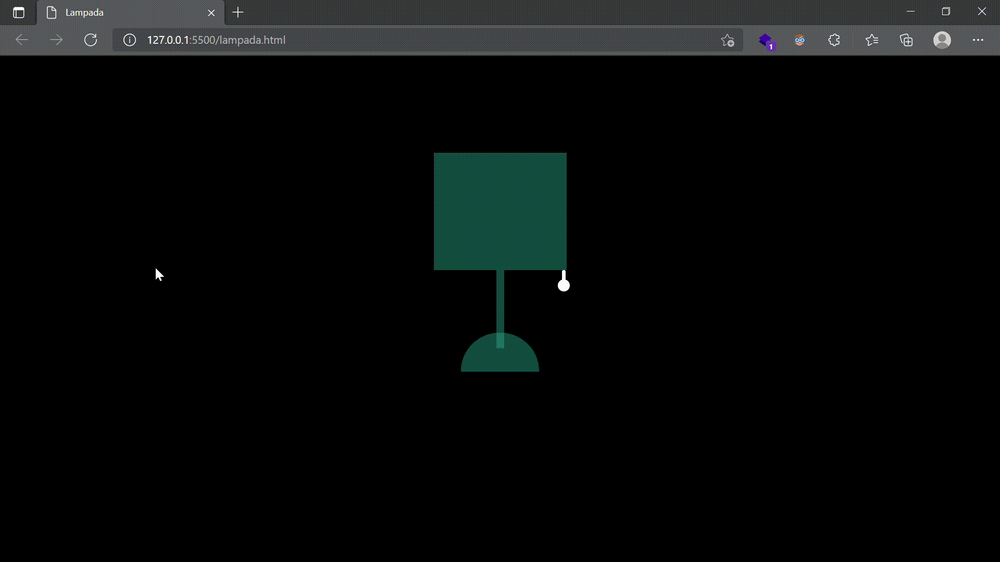

# Lampada
 
Luminaria criada com HTML5 e CSS3, sem o uso de JavaScript

<h2 id="objetivo">Objetivo:</h2>

Projeto criado com o intuito de colocar em prática o que fora ensinado nas aulas  do instituto Proa.

<h2 id="tecnologias">Tecnologias:</h2>
 

 
